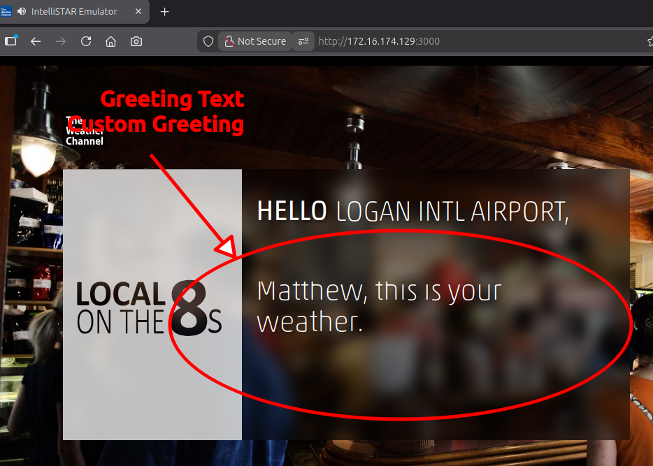
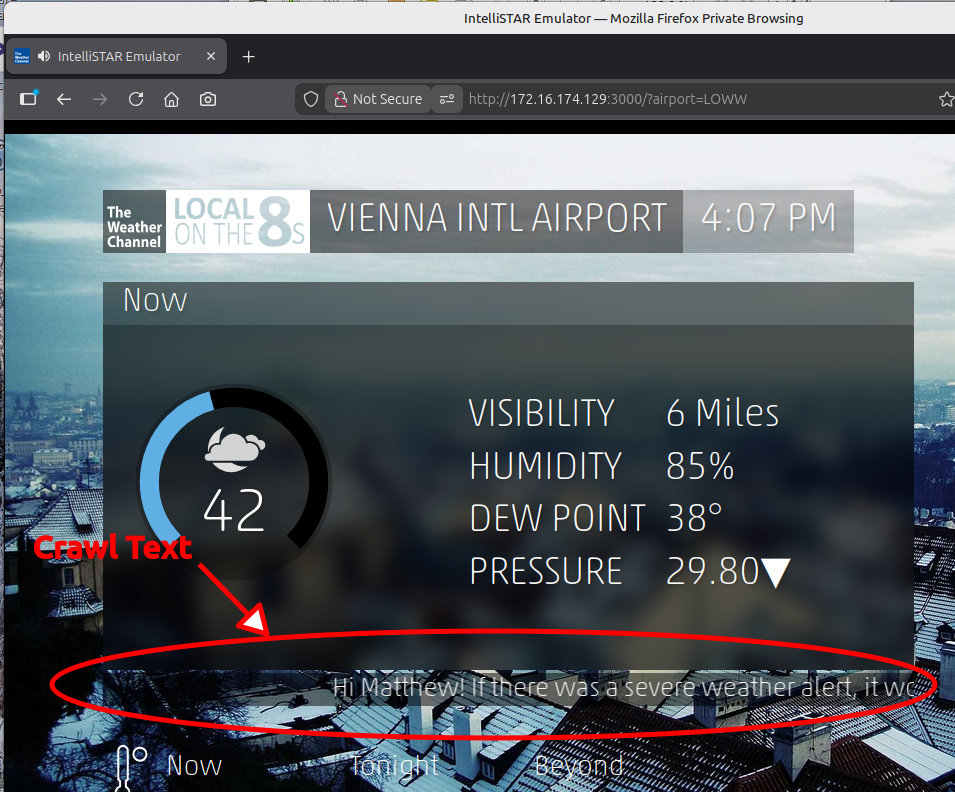
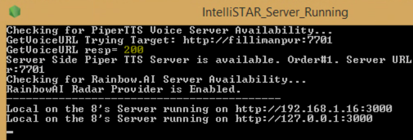

### TWC Local on the 8's IntelliSTAR Emulator - Advanced Configuration and Troubleshooting

#### Advanced Configuration

The common_configuration.js file holds configuration items that do not need to be routinely changed by the user. 

It is a javascript language file and follows the javascript syntax conventions. It can be edited in any editor that handles text, but an editor that understands javascript would help in avoiding errors.

It consists of the following sections:

#### General
+ greetingText: This is the text string displayed and spoken on the initial greeting page. It can be overridden by the "Custom Greeting" field on the main UI dialog. If the "Custom Greeting" field is left blank, this string is used instead.



+ crawlText: This is the text string displayed and horizontally scrolled along the bottom of the weather information box during the presentation. If an alert is active (and has not been disabled), then the alert text will be shown instead. This text is not narrated.


+ twcAPIKey: This is the API key for accessing the weather data. Only change this if the existing key is no longer valid.

#### Radar

Historically, the original radar was US only and used the US National Weather Service radar depiction captured in an i-frame. While that method works for US locations, it is very slow to load and is resource intensive. On slower devices such as streaming sticks or smart TVs, it was so slow that it often failed to load or would only display for a second or two.

The current IntelliSTAR emulator supports a variety of radar data providers, some of which provide worldwide coverage. In addition, the radar data is now handled by leaflet, resulting in vastly improved loading times and display even on limited hardware.

In addition, the emulator now supports a separate configuration for US radar and international radar providers. This allows using a free US only provider for US locations and a different provider for international locations.

##### Configuring the Radar Provider
+ ProviderWW & ProviderUS: This is the text code for the desired radar data provider, the suffix US is for US locations and WW is for non-US locations..
Refer to the configuration file for the currently supported providers.
+ APIKeyWW & APIKeyUS: This is the API key for accessing the radar data from certain providers. If a key is required it will be noted in the provider synopsis.

##### Supported radar data providers:
1. "leaflet-iowastate"
    + (FREE, US ONLY, DEFAULT) This provider uses the leaflet framework to combine openstreetmap.org map data with Nexrad Mosaics obtained directly from the Iowa State University Mesonet. US Base Reflectivity (N0Q) Composite images are used.
1. "leaflet-rainviewer"
    + (FREE currently, WORKS WORLDWIDE, NON STANDARD RADAR COLORS, default for non-US locations) This provider uses the leaflet framework to combine openstreetmap.org map data with rainviewer.com radar data. Commercial provider rainviewer.com provides a free API that aggregates the mesonet radar image data from Iowa State University in the US. In other parts of the world local radar data is provided by the local weather authority. This provider loads extremely fast and works well on all tested platforms. However, the radar images seem to be off color and there are a lot of error frames and false echos from this provider. This is the non-commercial API which may be limited or discontinued in the future.
1. "leaflet-xweather" 
    + (API KEY REQUIRED not free, WORKS WORLDWIDE) This provider uses the leaflet framework to combine openstreetmap.org map data with xweather.com radar data. Loads fast and works well on all tested platforms. However, there is no free API key (not even for non-commercial use) so you will have to acquire a valid key to use this provider.\
    When using this provider the radarAPIKey must also be specified as follows:
        + APIKeyWW/APIKeyUS: "(AERIS_ID)_(AERIS_KEY)"\
        where the AERIS ID and AERIS KEY is combined in a single string with an underscore inbetween. The parenthesis are for clarity and should not be included in the string
1. "leaflet-rainbowai" 
    + (API KEY REQUIRED very limited free tier, WORKS WORLDWIDE) This provider uses the leaflet framework to combine openstreetmap.org map data with rainbow.ai radar data. Loads fast and works well on all tested platforms. However, an API Key is required to use this provider, and a payment method is required to be on-file to use the "free" tier.\
    See https://developer.rainbow.ai/ for specific details and to obtain an API key.\
    When using this provider the radarAPIKey must also be specified as follows:
        + APIKeyWW/APIKeyUS: "RAINBOW.AI KEY"
    
        There are additional implementation requirements for this specific provider.\
        See below for more information.
1. "direct-nws"
    + (FREE, US ONLY, SLOW) This is the original provider where the US national weather service radar page is encapsulated within an i-frame and displayed. This approach is very slow and impacts performance on light-duty appliances such as fire stick or onn streaming box. On these underpowered devices the radar will often fail to load prior to the presentation moving on to the next page.

    ##### Additional Requirements when using the Rainbow.AI Radar Provider
    1. Due to CORS limitations in the API, only the IntelliSTAR emulator server can access this provider directly. 
        + Therefore this provider is client-server only, and must be configured on the web server computer. The web clients access the radar data indirectly via the IntelliSTAR emulator.
        + The API key resides on the server and is not exposed in the client.
    1. Billing: The free tier consists of a limited number of radar tile requests per month before the payment method on file is automatically charged. As of March 2026, the free tier is 30,000 map tiles per month (subject to change at any time by the vendor). The IntelliSTAR emulator requests approximately 100 map tiles for each non-alert run, and 200 map tiles for each run when an alert is active. The Rainbow.AI account dashboard displays near real-time statistics regarding requests that have been made.\
    **_Charges will automatically accrue after the free usage allotment is exhausted in a given month so care must be taken not to exceed the current limits to avoid being billed._**
    ##### Configuring the Rainbow.AI Radar Provider
    1. Establish an account at https://developer.rainbow.ai/ to obtain an API key.
    1. Edit the common_configuration.js file on the IntelliSTAR emulator web server and set the radarProvider: to "leaflet-rainbowai" and the radarAPIKey: to the API key obtained in Step #1.
    1. Save the changes to the configuration file.
    1. Re-start the web server. On the web server initialization screen the status of the Rainbow.AI provider should appear as "RainbowAI Radar Provider is Enabled."
    
    
        If an error message is displayed, check to make sure that the API key is valid and is quoted inside the configuration file.

##### Radar Options Common to all Providers
The normal radar is a Regional 2-hour historical rainfall depiction. For US locations only, when there is an active weather alert issued by the NWS there is an additional radar panel called Local which is a 2-hour historical rainfall depiction of a smaller area. The area size (zoom level from world view) can be configured for each radar depiction. The zoom level is an integer from 1 through 13 that defines the area that the map covers. For most cases a zoom level of 6 to 12 is appropriate.
+ zoomLevelRegional: Regional radar zoom level (default 8)
+ zoomLevelLocal: Local radar zoom level (default 10)
>[!IMPORTANT]
>High zoom levels depict more detail and require more map tiles to be sent by the radar data provider. Providers that charge a fee based on usage (such as Rainbow.AI) will charge more for detailed maps. Some free providers (such as rainviewer) limit the maximum zoom level to 7. In this case requesting a higher zoom level will result in browser based image scaling of a level 7 map which may result in pixelation of the image.

#### PiperTTS
This section controls access to a PiperTTS voice server. It is used by both the web server and the web client to determine the appropriate PiperTTS server to use and whether the server or the client should be making the requests.

There are a group of possible endpoints, and each endpoint consists of a set of fields that describe who and how the PiperTTS server should be contacted. The default values are suitable in most cases, but may need to be changed depending on the specific availability in the future.

##### Fields in Each Endpoint
+ **order:** A number from 0 through 9 that determines availability, and then the priority order of use. Values and their meaning:
    + 1= There should be exactly one entry present with an order of 1, and this endpoint will be considered the primary method to contact the PiperTTS voice server.
    + 2-9= _(optional)_ There may be additional endpoints configured with an order of 2 through 9. A specific order number should only reference one endpoint. If present AND the primary server (order #1) is not responding, then each endpoint in ascending order will be contacted to see if it responds. If no servers respond, then voice narration will be disabled for the web client.
    + 0= _(optional)_ There may be one or more endpoints configured with this order. This endpoint entry is a placeholder but is disabled and is not contacted. 
+ **type:** Whether the web client "Client" or the web server "Server" should attempt to communicate with the PiperTTS voice server.
    + In "Client" mode, the web client (web browser) contacts the specified enpdoint directly for voice data. The web server does not. The url specified must be reachable directly from the web browser that the client is using.
    + In "Server" mode, the web server that is hosting the IntelliSTAR emulator is responsible for interacting with the PiperTTS server. The url specified must be reachable directly from the web server. The web client does not need access to the PiperTTS server and will still be able to play the narration.
+ **url:** The web address of the PiperTTS voice server.

### Configuring the IntelliSTAR Emulator to Use a PythonAnywhere Hosted PiperTTS Server
> [!IMPORTANT]
>You will need the complete web address (url) of the operational PiperTTS server prior to updating the IntelliSTAR emulator configuration.

1. Open the common_configuration.js file which is located in the root folder of the IntelliSTAR Emulator project in a text editor.
1. Scroll down to the PiperTTS: section, and then further down locate a suitable unused endpoint (one that has an oder=0 currently) to assign to the pythonanywhere.com hosted PiperTTS voice server.

    > [!NOTE]
    >By default there will be one sample configuration for "type: Server", and one sample configuration for "type: Client". Which one to select depends on whether the IntelliSTAR Emulator Webserver or the client's web browser (or both) is able to access the pythonanywhere.com based server.

    If the pythonanywhere.com based PiperTTS server can be accessed by:

    + The computer running the IntelliSTAR emulator website, then:
        + Use an enndpoint with a "type: Server"\
        OR
    + The client's web browser directly, then:
        + Use an enndpoint with a "type: Client"\
        OR
    + Both of the above, then:
        + Use either "type: Server" or "type: Client"

1. Edit or add the desired endpoint entry as follows:
    + **order:1** (or a higher number if this connection should be a secondary or fallback server to another primary server)
        + Make sure that no other order has the same number. Adjust the sequence or set other unused entries to an order of zero (0).
    + **type: Server** or **type: Client** as discussed above.
    + **url:** _full url of the pythonanywhere.com PiperTTS server_ (enclosed in quotation marks).

    Example:\
    If the pythonanywhere.com PiperTTS server url is:
    https://myusername.pythonanywhere.com/\

    Then a typical client type entrey would be the following:
    ```
    {order:1, type: "Client", url:"https://myusername.pythonanywhere.com"},
    ```

1. After making the necessary changes, save and exit the editor.
1. Finally, if a **type: Server** was configured, restart the IntelliSTAR emulator web server for the changes to take effect.


### Troubleshooting
Tips for identifying and resolving issues with the IntelliSTAR emulator not covered in the main instructions will be placed here.