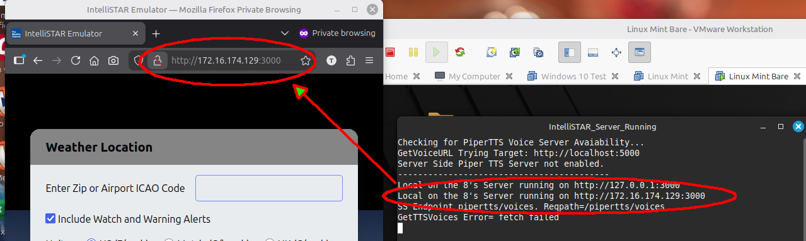
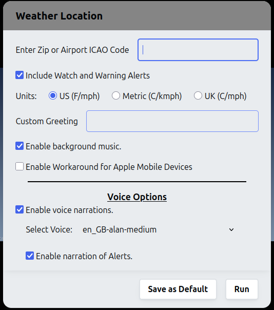
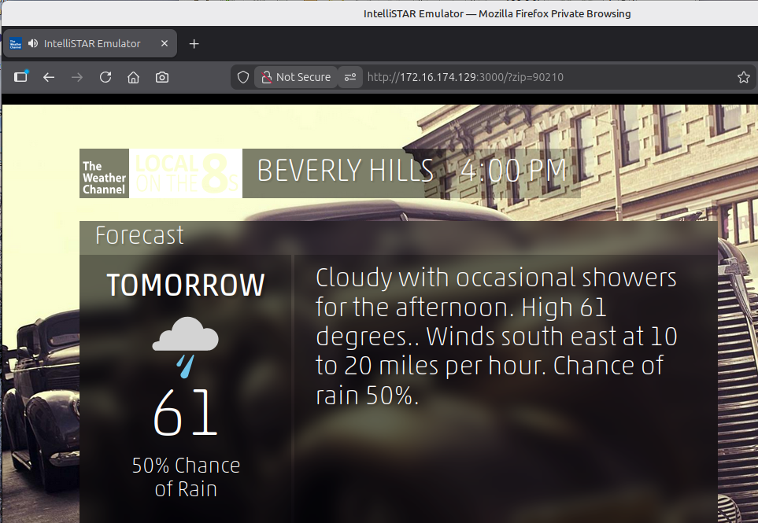
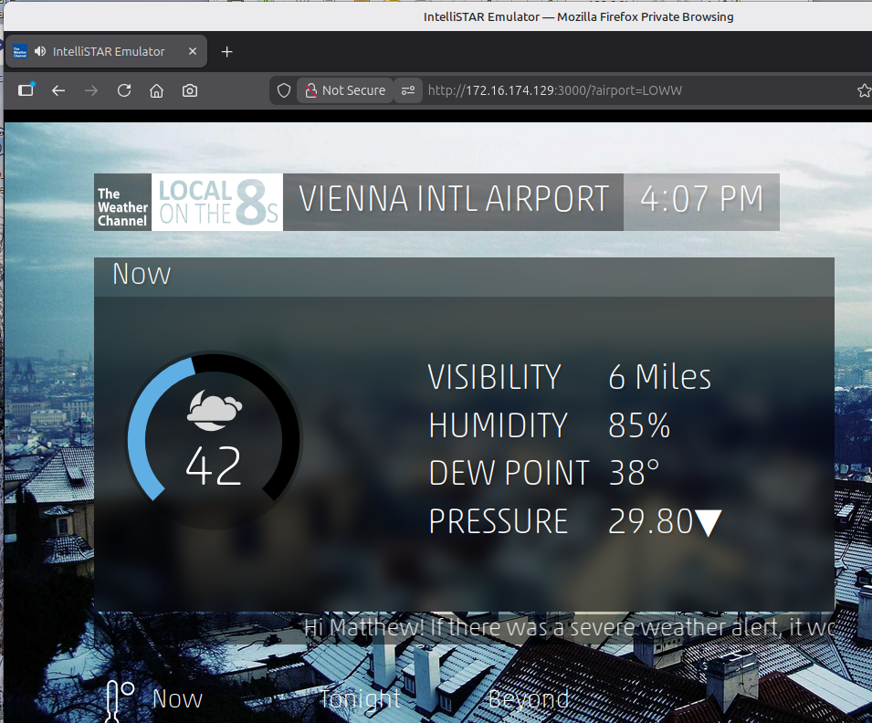
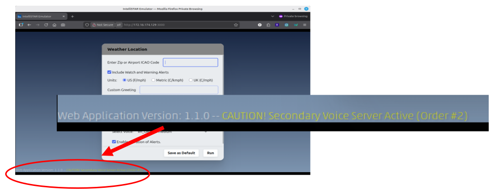

### TWC Local on the 8's IntelliSTAR Emulator - Using the Website

Most modern browsers on most modern systems can operate the IntelliSTAR emulator. So far this emulator has been tested with Firefox on Windows and Linux, Chrome on Windows and Linux, Safari on Macintosh and iPad.

#### Usage:

1. Open a web browser on a computer that has access to the ImtelliSTAR Emulator url.
1. Type the url into the browser's address bar.\
Example, using Firefox running in Linux with a locally accessible server:
 

1. A Dialog will appear:


    #### Information on each item in the dialog:

    + **"Enter Zip or Airport ICAO Code"**\
    Enter any valid 5 digit US zip code or any valid 4 character Airport ICAO code worldwide. The Emulator will retrieve the current and forecasted weather from the area around the entered location.
        >[!NOTE]
        >Do not press the ENTER key after making the entry initially.\
        Instead use the mouse or the TAB key on the keyboard for navigation.\
        Pressing ENTER after making an entry in this box is a shortcut to run the emulator with the location entered.
    
    + **"Include Watch and Warning Alerts"**\
    If this option is checked, watches and warnings issued by the national weather service will be displayed (and narrated if enabled) prior to the main current conditions and forecast pages are displayed.\
    As these watches and warnings can be quite lengthy, this option allows them to be bypassed entirely.

    + **"Units"**\
    Choose the desired units group for weather data measurements. The 1st parameter is temperature F=Fahrenheit, C=Celsius. The 2nd parameter is wind speed mph=miles per hour, kmph=kilometers per hour.

    + **"Custom Greeting"**\
    On the initial weather Welcome/Greeting page, a personal message can be displayed (and narrated). The default message is set in the common_configuration.js file but a phrase or sentence entered here will override the default.

    + **"Enable background music"**\
    If this option is checked, the Local on the 8's smooth jazz background music will play throughout the forecast.

    + **"Enable Workaround for Apple Mobile Devices"**\
    If this option is checked, the background music will be silenced completely when the voice narration is being spoken. This is necessary for Apple devices because they do not support the emulator adjusting the volume levels during playback.\
    If this option is unchecked, the default, background music will duck (become quieter) while voice narration is taking place and then resume normal volume after the narration has finished.
        >[!NOTE]
        >If this option is left unchecked on an Apple mobile device and narration and backgroud music are both enabled, the music and narration will both be played at full volume making the narration difficult to hear.
    
    #### Voice Options

    + **"Enable voice narrations"**\
    If this option is checked, and a PiperTTS voice server is available, many elements will be narrated as well as displayed. These elements include the greeting message, any active alerts, the current conditions, the local forecast, and each page heading.

    + **"Select Voice"**\
    If voice narrations are enabled and a PiperTTS voice server is reachable, the list of voices available on the server will populate this drop-down list. Select from the available voices to hear the narration read in the chosen voice.

    + **"Enable narration of Alerts"**\
    If this option is checked, and a PiperTTS voice server is available, and there are active alerts, the alert text will be narrated while it is being displayed. The emulator will pause each alert page for as long as necessary to completely read the alert text.\
    If this option is disabled and there are active alerts, the alerts will only be displayed and not narrated. The display time is fixed at eight seconds per alert page (which is typically much shorter than the time required for the spoken narration).

    #### Operation Buttons

    + **"Save as Default"**\
    When this button is pressed, the current values of all the options and settings in the dialog are saved to the browser persistent storage under the current user's profile.\
    Each time the same user opens the same url in the same browser, the saved settings will be automatically restored, the dialog will be populated to reflect these saved settings, and the emulator will use these saved settings if the emulator is run using a shortcut or url parameter location.


    + **"Run"**\
    When this button is pressed and a valid US 5-digit zip coder or 4 character airport ICAO code was entered, the emulator will obtain the current weather data for the location specified and start the Local on the 8's presentation.

1. After the location has been specified and any options set as described above, press the **"Run"** button to start the Local on the 8's presentation.

#### Shortuts
+ In UI mode (with only the base url entered in the address bar), simply type the desired 5-digit US zip code or 4 character airport ICAO code and then press the ENTER key. The emulator will obtain the current weather data for the location specified and start the Local on the 8's presentation.

+ **Direct Operation Mode**\
    Appending:
    ```
    ?zip=nnnnn
    (where nnnnn is a valid 5-digit US zip code)
    ```
    OR
    ```
    ?airport=cccc
    (where cccc is a 4 character airport ICAO code)
    ```
    to the end of the base url will bypass the UI dialog and start the Local on the 8's presentation for the specified zip or airport code.

    #### For example
    US Zip Code:

    

    International Airport ICAO Code:

    


#### Troubleshooting Voice Narration at the Client

When invoked in UI mode (without any shortcuts), information regarding the ability of the web client to communicate with a PiperTTS voice server will be shown at the bottom of the window:




Possible color-coded voice server status messages and their meaning:
+ ${\textsf{\color{green}Primary Voice Server Active}}$\
The primary voice server (order #1) in the global_configuration.js file was contacted and is responsive.
+ ${\textsf{\color{Goldenrod}CAUTION! Secondary Voice Server Active (Order n)}}$\
The primary voice server (order #1) in the global_configuration.js file is non-responsive, but a secondary or fallback server was contacted and is responsive.
+ ${\textsf{\color{red}No PiperTTS voice server available.}}$\
No voice servers are configured or none of the servers listed in the global_configuration.js file are responsive. Voice narration will be unavailable.

For help resolving the yellow caution or red no voice server available messages, refer to the [Advanced Configuration and Troubleshooting Guide]().
