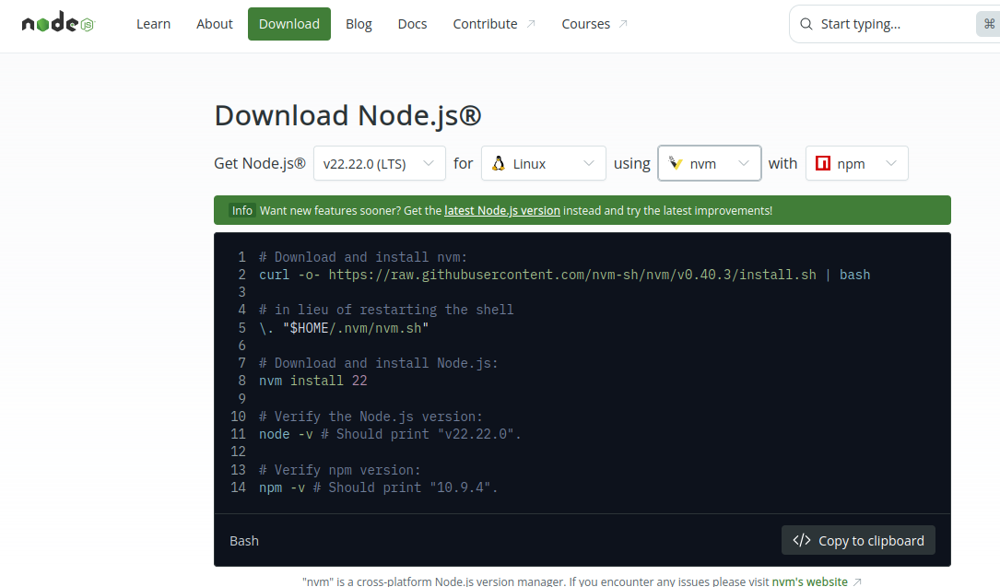
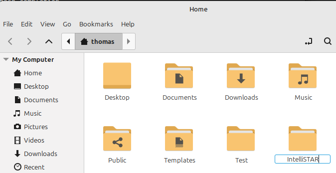
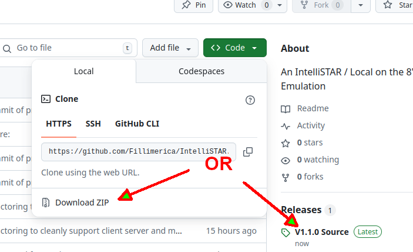
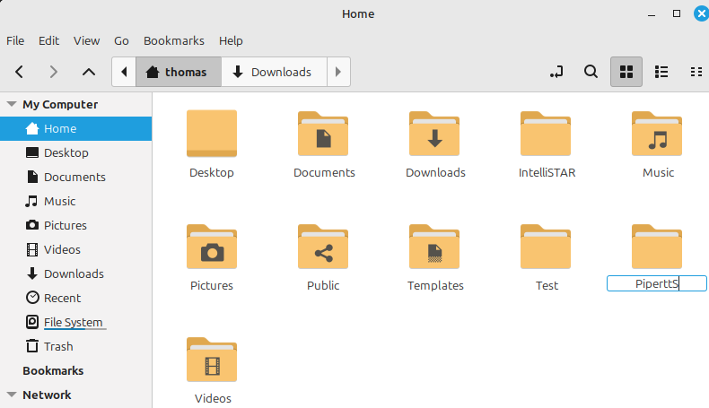
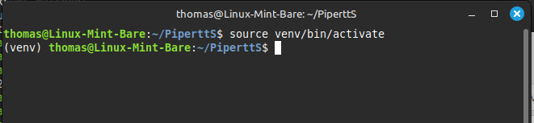
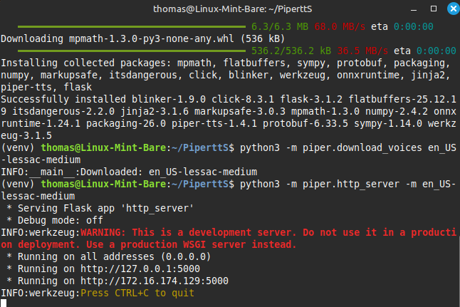
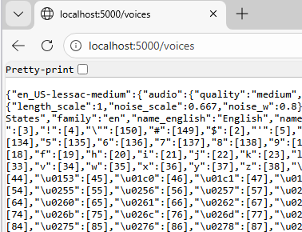

### TWC Local on the 8's IntelliSTAR Emulator - Local Deployment Instructions

#### Linux Mint/Ubuntu - Step by Step

A webserver is required to host the IntelliSTAR emulator website. While there are many webservers available, for local deployment and testing these instructions will cover using Node.JS with Express on Linux.

#### Local Deployment on Linux Mint/Ubuntu

1. Install a recent version of NodeJS from the official website:

   <p align="center">https://nodejs.org/en/download</p>

   <p align="center">
      
   </p>

   For Linux, it is recommended to use the bash script from a terminal.

   1. Open a terminal.
   1. Copy and paste the commands listed on the website into the terminal.
   1. Be sure to verify that the correct version of NodeJS is reported after the installation has finished.


1. Create an installation folder to hold the IntelliSTAR emulator files.
   
   

   This can be placed in any writable drive location, but a folder located under the logged in user's home directory is recommended.

1. Download and extract the IntelliSTAR Emulator files from the Github repository.
    Assuming Git is not installed, use either the "Download ZIP" option under "<> Code" OR select the latest release in the Releases Panel.
    

1. With either method, a zip file will be placed in the download folder. Extract the contents into the application path that was created in step #2:
    1. Open the download folder.
    1. Move the zip file that was just downloaded into the folder that was created in step #2 above.
    1. Right click on the zip file after it has been moved.
    1. Choose "Extract Here" from the context menu.
    1. After the contents have been extracted, the zip file can be deleted.
<br>
1. Install Node.JS Express into the Emulator Project Directory.
   1. Navigate to the folder where the IntelliSTAR emulator files were extracted. They will moost likely be in a sub-folder after the extraction. (Look for the index.html and the StartServer.bat files.)
   1. Right click on a blank area of the directory and choose "Open in Terminal". A terminal window with the emulator folder as the current directory should open on the desktop.
   1. Install NodeJS Express here by typing the following command:
      ```
      npm install express
      ```

At this point the IntelliSTAR emulator is installed without local voice narration. Voice narration may be available from public sources (or not) but ideally a local PiperTTS server should also be installed to provide these services locally.

Next Steps..\
[Continue with Installation of a PiperTTS Server on the same computer](#local-pipertts-deployment-on-linux)
(recommended)\
OR\
[Running the IntelliSTAR Emulator without local voice support]()

---

#### Local PiperTTS Deployment on Linux

Performing this tasks involves installing a recent version of the Python language, along with the PiperTTS web server from Github. The PiperTTS server may be installed on the same computer as the main IntelliSTAR emulator (recommended) or on a different computer within the local network (which requires some additional configuration). These instructions cover installing the PiperTTS server on the same computer.

> [!NOTE]
> It does not matter whether the IntelliSTAR emulator or the PiperTTS server are installed first. They operate completely independently of each other and run in separate environments.

1. Install a recent version of Python for Linux, from the Python.org website if it is not already installed. Check the installed version using the following command:
   ```
   python3 --version
   ```
   Any version of python in the 3.10 series or greater is acceptable for the PiperTTS server.

2. Create an installation folder to hold the PiperTTS server files.
   
   

    This can be placed in any writable drive location, but a folder located under the logged in user's home directory is recommended.

1. Install the PiperTTS server.

   1. Right click on the icon of the directory just created and choose "Open in Terminal". A terminal window with the chosen installation  folder as the current directory should open on the desktop.

   1. Create a python virtual environment for the server using the following command:

      ```
      python3 -m venv venv
      ```

      >_Note: Yes, the venv is repeated. The 1st is the command to create and the second is the actual name of the sub-folder where the virtual environment will be stored. Technically it can be named anything, but venv is a common convention._

      > [!IMPORTANT]
      > Certain required python components may not already be installed when the virtual environment is attempting to be created.\
      If that is the case for your Linux distribution, follow the guidance in any error messages received.\
      Repeat the base command once all the requirements have been satisfied.


   1. Activate the virtual environment by typing the following command:

      ```
      source venv/bin/activate
      ```
      If everything is okay up to this point, the terminal prompt should change to have venv in parenthesis preceding the path, like in this example:

      

   1. Run the following command to perform the PiperTTS server installation:

      ```
      python3 -m pip install piper-tts[http]
      ```
      A number of dependent packages and the main PiperTTS application should now be downloaded and installed within the venv sub-folder. Wait for it to finish and the command prompt re-appears.

1. Download an initial voice to use with the local server. Type the following command:
   ```
   python3 -m piper.download_voices en_US-lessac-medium
   ```
   Other voices are available and can be downloaded and added to the server later. This initial voice is sufficient for confirming the installation and basic operation of the PiperTTS server.

1. Start the PiperTTS Web Server using the following command:
   ```
   python3 -m piper.http_server -m en_US-lessac-medium
   ```
   The python web server should start and you should see it running in the terminal window:

   

1. Test basic server responsiveness by attempting to get the installed list of voices in the web browser on the local computer:

   1. On the same computer, launch any web browser.
   1. In the address bar, type in the following local web address:

      ```
      http://localhost:5000/voices
      ```
      If the PiperTTS has been installed and is running it should respond with the installed voice list and other voice data, similar to the following:
      >

### Congratulations, the Local Deployment Installation is Complete!

Next Steps..\
[Running the IntelliSTAR Emulator]()

