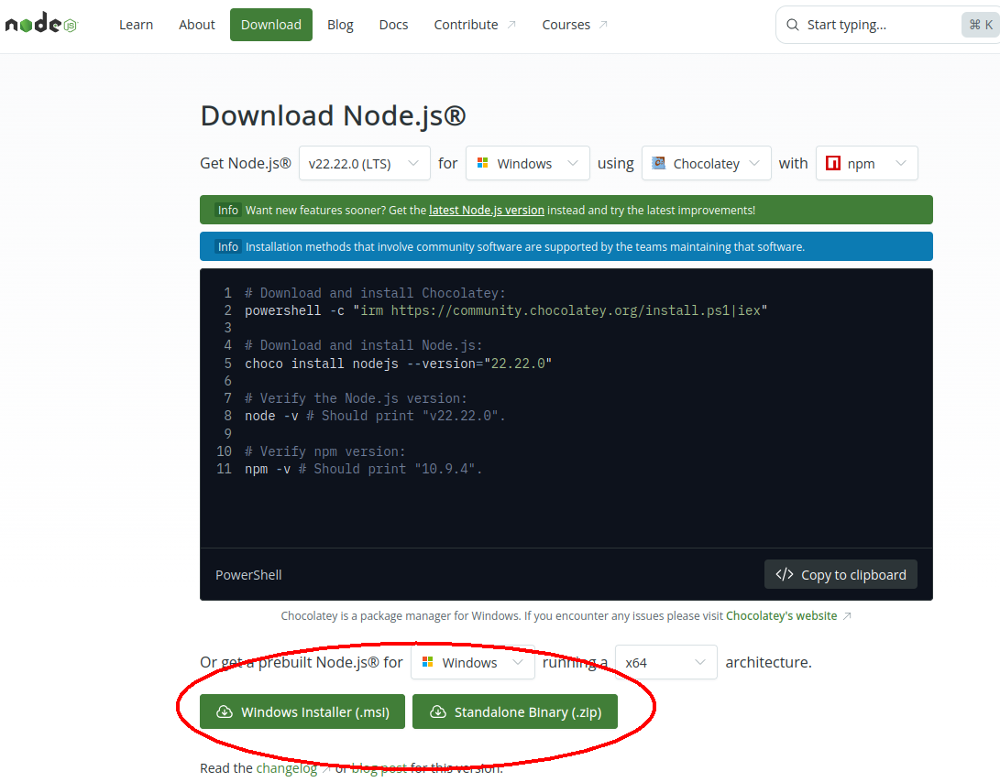
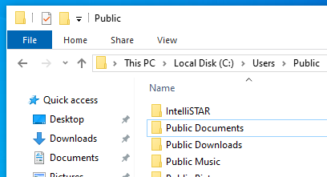
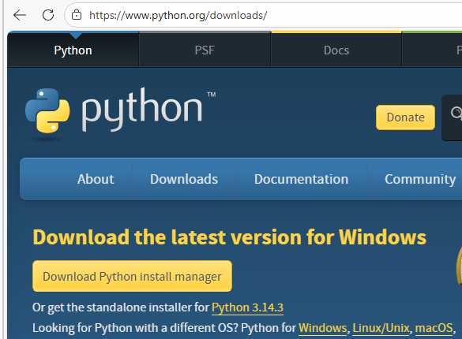
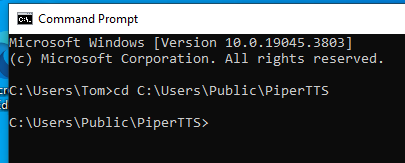
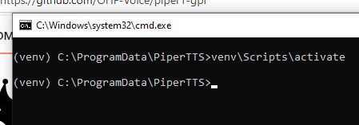

### TWC Local on the 8's IntelliSTAR Emulator - Local Deployment Instructions

#### Windows 10 - Step by Step

A webserver is required to host the IntelliSTAR emulator website. While there are many webservers available, for local deployment and testing these instructions will cover using Node.JS with Express on Microsoft Windows.

#### Local Deployment on Windows 10 (Windows 11 should work similarly)

1. Install a recent version of NodeJS from the official website:

<p align="center">https://nodejs.org/en/download</p>

<p align="center">
    
</p>

Use either the powershell download instructions or simply download a pre-built msi installer for Windows.

2. Complete the Node.JS setup. The installer defaults are fine for this installation.

3. Create an installation folder to hold the IntelliSTAR emulator files.
   
   

This can be placed in any writable drive location, but a folder located under C:\Users\Public\ is suggested.

4. Download and extract the IntelliSTAR Emulator files from the Github repository.
    Assuming Git is not installed, use either the "Download ZIP" option under "<> Code" OR select the latest release in the Releases Panel.
    

5. With either method, a zip file will be placed in the download folder. Extract the contents into the application path that was created in step #3:
    1. Open the download folder.
    1. Right click on the zip file that was just downloaded.
    1. Choose "Extract All..." from the context menu.
    1. In the "Select a Destination and Extract Files" either type in the path created in Step #3 above or use the browse button to graphically navigate to this path.
    1. Click on Extract to complete the file extraction.

1. Install Node.JS Express into the Emulator Project Directory.
   1. Open up a command prompt. (WinKey+R, then type cmd and press Enter)
   1. Navigate to the folder where the IntelliSTAR emulator files were extracted.
   Here is how to accomplish that:
      1. Click on the file explorer window that has the extracted IntelliSTAR files. (This will be in a sub-folder, look for the index.html and the StartServer.bat files.)
      1. Right click on the address bar that shows the path to the files.
      1. From the context menu, choose "Copy Address" or "Copy Address as Text".
      1. Click back in the command prompt window.
      1. Type CD, followed by a single space, then hit Ctrl+v to paste the full path which should appear on the command line.
      1. Finally press enter to navigate to the path.
   1. Install NodeJS Express here by typing the following command:
      ```
      npm install express
      ```

At this point the IntelliSTAR emulator is installed without local voice narration. Voice narration may be available from public sources (or not) but ideally a local PiperTTS server should also be installed to provide these services locally.

Next Steps..\
[Continue with Installation of a PiperTTS Server on the same computer](#local-pipertts-deployment-on-windows-10)
(recommended)\
OR\
[Running the IntelliSTAR Emulator without local voice support]()

---

#### Local PiperTTS Deployment on Windows 10

Performing this tasks involves installing a recent version of the Python language into Windows, along with the PiperTTS web server from Github. The PiperTTS server may be installed on the same computer as the main IntelliSTAR emulator (recommended) or on a different computer within the local network (which requires some additional configuration). These instructions cover installing the PiperTTS server on the same computer.

> [!NOTE]
> It does not matter whether the IntelliSTAR emulator or the PiperTTS server are installed first. They operate completely independently of each other and run in separate environments.

1. Install a recent version of Python for Windows, from the Python.org website. For Windows it is recommended to install the Python install manager, which is the large yellow button on the download page:


 <p align="center">https://www.python.org/downloads/</p>

<p align="center">  
   
</p>
   
> [!WARNING]
> Installing Python from the Microsoft store is not recommended!

2. Create an installation folder to hold the PiperTTS server files.<br>
    This can be placed in any writable drive location, but a folder located under C:\Users\Public\ is suggested. 

1. Install the PiperTTS server.
   
   1. Open up a command prompt. (WinKey+R, then type cmd and press Enter)
   
   1. Navigate to the folder to hold the PiperTTS server files created in Step #2 above.<br>Here is how to accomplish that:
   
      1. Click on the file explorer window that has the empty new folder that was created in Step #2 above. Open up the folder (it should be empty inside).
   
      1. Right click on the address bar that shows the path to the files.
   
      1. From the context menu, choose "Copy Address" or "Copy Address as Text".
   
      1. Click back in the command prompt window.
   
      1. Type CD, followed by a single space, then hit Ctrl+v to paste the full path which should appear on the command line.
   
      1. Finally press enter to navigate to the path.

      >By way of an example, if the Piper TTS server is to be located in C:\Users\Public\PiperTTS, then after the steps above the command prompt should appear as in the following:

      >

   1. Create a python virtual environment for the server using the following command:

      ```
      python3 -m venv venv
      ```

      >_Note: Yes, the venv is repeated. The 1st is the command to create and the second is the actual name of the sub-folder where the virtual environment will be stored. Technically it can be named anything, but venv is a common convention._


   1. Activate the virtual environment by typing the following command:

      ```
      venv\Scripts\activate
      ```

      >_Note: You are actually running a batch file called activate.bat from the Scripts folder under the venv folder that was just created._

      If everything is okay up to this point, the command prompt should change to have venv in parenthesis preceding the path, like in this example:

      

   1. Run the following command to perform the PiperTTS server installation:

      ```
      python3 -m pip install piper-tts[http]
      ```
      A number of dependent packages and the main PiperTTS application should now be downloaded and installed within the venv sub-folder. Wait for it to finish and the command prompt re-appears.

1. Install the Windows Certificate Store module for python:
   ```
   python3 -m pip install pip-system-certs
   ```

1. Download an initial voice to use with the local server. Type the following command:
   ```
   python3 -m piper.download_voices en_US-lessac-medium
   ```
   Other voices are available and can be downloaded and added to the server later. This initial voice is sufficient for confirming the installation and basic operation of the PiperTTS server.

1. Start the PiperTTS Web Server using the following command:
   ```
   python3 -m piper.http_server -m en_US-lessac-medium
   ```
   The python web server should start and you should see it running in the command window:

   

1. Test basic server responsiveness by attempting to get the installed list of voices in the web browser on the local computer:

   1. On the same computer, launch any web browser.
   1. In the address bar, type in the following local web address:

      ```
      http://localhost:5000/voices
      ```
      If the PiperTTS has been installed and is running it should respond with the installed voice list and other voice data, similar to the following:
      >

### Congratulations, the Local Deployment Installation is Complete!

Next Steps..\
[Running the IntelliSTAR Emulator]()

