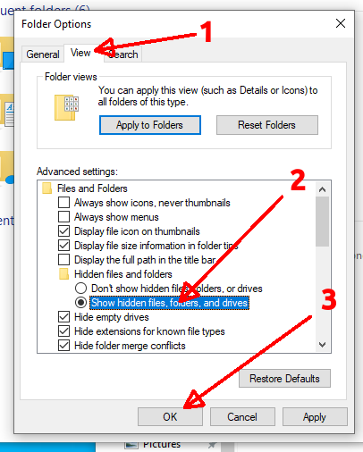

### TWC Local on the 8's IntelliSTAR Emulator - Local Deployment Instructions

A webserver is required to host the IntelliSTAR emulator website. While there are many webservers available, for local deployment and testing these instructions will cover using Node.JS with Express on either Windows or Linux.

#### Local Deployment on Windows 10 (Windows 11 should work similarly)

1. Install a recent version of NodeJS from the official website:
    [NodeJS Download](https://nodejs.org/en/download)
    
    Use either the powershell download instructions or simply download a pre-built msi installer for Windows.
2. Complete the Node.JS setup. The installer defaults are fine for this installation.
3. Create an installation folder to hold the IntelliSTAR emulator files.
   

This can be placed in any writable drive location, but a folder located under C:\ProgramData\ is suggested. If using a sub-folder of C:\ProgramData, it may be beneficial to enable viewing hidden files and folders. 

Here is how to do that:
3a. Open a file explorer window. 
3b. Click on the File Menu in the upper left.
3c. Select the "Change folder and search options" item from the menu.
3d. In the Folder Options window that appears click on the View Tab.
3e. Select the option under "Hidden files and folders" that reads: "Show hidden files, folders, and drives.
3f. Click on the Ok button to save the settings and dismiss the Folder Options window.
Hidden folders, such as C:\ProgramData will now be visible in the Windows File Explorer.

4. Download and extract the IntelliSTAR Emulator files from the Github repository.
    Assuming Git is not installed, use either the "Download ZIP" option under "<> Code" OR select the latest release in the Releases Panel.
    

5. With either method, a zip file will be placed in the download folder.
    5a. Open the download folder.
    5b. Right click on the zip file that was just downloaded.
    5c. Choose "Extract All..." from the context menu.
    5d. In the "Select a Destination and Extract Files" either type in the path created in Step #3 above or use the browse button to graphically navigate to this path.
    5e. Click on Extract to complete the file extraction.

6. Install Node.JS Express into the Emulator Project Directory.
    5a. Open up a command prompt. (WinKey+R, then type cmd and press Enter)
    5b. Navigate to the folder where the IntelliSTAR emulator files were extracted.
    Here is how to accomplish that:
   
   1. Click on the file explorer window that has the extracted IntelliSTAR files. (This will be in a sub-folder, look for the index.html and the StartServer.bat files.)
   2. Right click on the address bar that shows the path to the files.
   3. From the context menu, choose "Copy Address" or "Copy Address as Text".
   4. Click back in the command prompt window.
   5. Type CD, followed by a single space, then hit Ctrl+v to paste the full path which should appear on the command line.
   6. Finally press enter to navigate to the path.
      5c. Install NodeJS Express here by typing the following command: 
      npm install express
      
At this point the IntelliSTAR emulator is installed without local voice narration. Voice narration may be available from public sources (or not) but ideally a local PiperTTS server should also be installed to provide these services locally.

Next Steps..
Continue with Installation of a PiperTTS Server on the same computer (reccomended):
OR
Runing the IntelliSTAR Emulator without local voice support:
