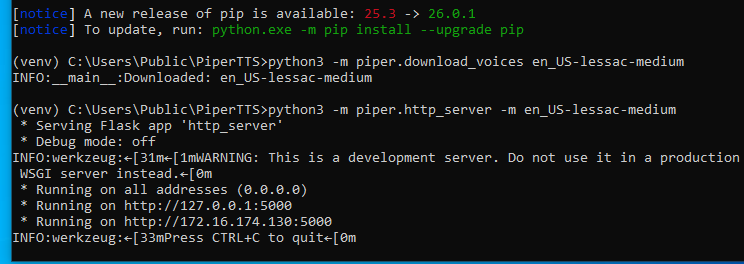
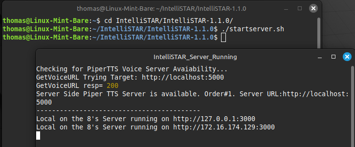
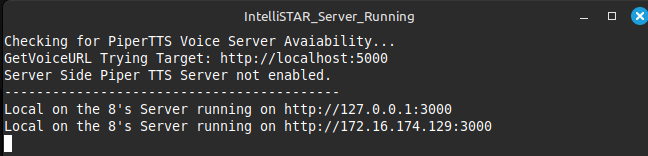

### TWC Local on the 8's IntelliSTAR Emulator - Local Deployment Configuration and Operation

> [!IMPORTANT]
> This guide assumes that the IntelliSTAR emulator has been installed on a local computer or virtual machine along with a local installation of the PiperTTS server.

#### Default Configuration
The configuration file is named common_configuration.js and is located in the root of the emulator. As downloaded from the repository the following default configuration is assumed:
+ Local Installation running under NodeJS Express
    + Default url is localhost on port 3000, or the computer's IP address on port 3000.
+ Local PiperTTS server running on the same computer under Python.
    + Default url is localhost on port 5000.

This default configuration should be sufficient if the software is deployed in this manner.\
If the PiperTTS server will be installed on a different computer, then the configuration file will have to be edited to reflect the exact url and port need to reach the PiperTTS server.

### Starting the Servers
> [!IMPORTANT]
>If both the IntelliSTAR emulator and the PiperTTS servers are installed on the same computer, be sure to start the PiperTTS server **FIRST** and verify it's responsiveness prior to starting the IntelliSTAR emulator. 

#### Starting the PiperTTS Server
1. Open a command prompt (Windows) or a terminal (Linux), and change the current directory to the PiperTTS installation folder.
1. Type the following command to start the server:

    Windows:
    ```
    startpiper.bat
    ```
    Linux:
    ```
    ./startpiper.sh
    ```

    The PiperTTS server should load and report the url(s) on which it can be reached:

    Windows:\
    

    Linux:\
    

##### Testing PiperTTS Server Responsiveness

1. Test basic server responsiveness by attempting to get the installed list of voices in the web browser on the local computer:

   1. On the same computer, launch any web browser.
   1. In the address bar, type in the following local web address:

      ```
      http://localhost:5000/voices
      ```
      If the PiperTTS has been installed and is running it should respond with the installed voice list and other voice data, similar to the following:
      >

#### Starting the IntelliSTAR Emulator Server

1. If the PiperTTS server is installed locally, start the PiperTTS server first and verify its responsiveness.

1. Open a command prompt (Windows) or a terminal (Linux), and change the current directory to the IntelliSTAR Emulator installation folder.
1. Type the following command to start the server:

    Windows:
    ```
    startserver.bat
    ```
    Linux:
    ```
    ./startserver.sh
    ```

    The IntelliSTAR Emulator server should load and report the following:
    + Which PiperTTS voice server is available.
    + The url(s) on which the IntelliSTAR Emulator can be reached.

    Windows:\
    

    Linux:\
    

### Congratulations, the IntelliSTAR Emulator is Running!

Next Steps..\
[Operating the IntelliSTAR Emulator](IntelliSTAR_Operation.md)

### Special Cases
#### Running the IntelliSTAR Emulator Without Local PiperTTS Voice Support

If it is not possible to have a local PiperTTS server running (for example when using a shared hosting service), the IntelliSTAR Emulator can still be hosted and run with the following limitations:
+ If a public or client accessible PiperTTS server is available, in some cases it can be used for voice narration.
+ If no PiperTTS server is available, the IntelliSTAR Emulator can be used with voice narration disabled. All other features will continue to operate.
>[!NOTE]
>It may also be possible to host a PiperTTS on a Python focused hosting service, such as pythonanywhere.com.\
For more information regarding this option, see the link at the bottom of this section to a Youtube tutorial where this option is explored.

Starting the IntelliSTAR Emulator on a server without local PiperTTS voice support is identical to starting it with voice support, except there is no PiperTTS server to start first.

[Starting the IntelliSTAR Emulator](#starting-the-intellistar-emulator-server)

When the IntelliSTAR Emulator is started in this manner it will attempt to find an alternate PiperTTS voice server in the common_configuration.js file. If an alternate server is available then it will be used instead, otherwise it will report that "Server Side Piper TTS Server not enabled.

The server startup window will report which type of PiperTTS server  (if any) was found. In this example there was no PiperTTS server available:



>[!NOTE]
>Even if the IntelliSTAR Emulator server does not find a suitable PiperTTS voice server to use, it is still possible that the web client can directly access a PiperTTS server.\
If this scenario exists, voice narration will still be available in the client.\
The web client will report if it was able to fall back to a client side accessible PiperTTS server when a server side PiperTTS server is unavailable.

Next Steps..\
[Operating the IntelliSTAR Emulator](IntelliSTAR_Operation.md)
